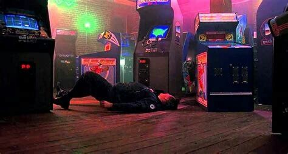

# Neon Pulse Arcade - Retro Chat Application


## 🕹️ Overview

Neon Pulse Arcade is a nostalgic retro-themed chat application that combines the aesthetics of 80s/90s arcade games with modern real-time communication features. Step into a world where retro meets reality, complete with pixelated graphics, CRT screen effects, and classic arcade sounds.

## ✨ Features

- **Retro UI**: Immersive 80s/90s arcade-inspired interface with scanlines, CRT effects, and pixel art
- **Real-time Chat**: Instant messaging with other users in the arcade lobby
- **Media Sharing**: Share images, GIFs, videos, and audio clips with other users
- **Voice Chat**: Connect with other users through real-time voice communication
- **Reactions**: React to messages with emoji reactions
- **User Presence**: See who's currently online in the arcade
- **Message Replies**: Reply directly to specific messages
- **Easter Eggs**: Discover hidden commands and secret features (try the Konami code!)
- **Responsive Design**: Works on desktop and mobile devices

## 🚀 Getting Started

### Prerequisites

- Node.js (v16 or higher)
- npm or yarn

### Installation

1. Clone the repository:
   ```bash
   git clone https://github.com/yourusername/neon-pulse-arcade.git
   cd neon-pulse-arcade
   ```

2. Install dependencies:
   ```bash
   npm install
   # or
   yarn
   ```

3. Start the development server:
   ```bash
   npm run dev
   # or
   yarn dev
   ```

4. Open your browser and navigate to `http://localhost:5173`

## 🔧 Technologies Used

- **Frontend**: React, TypeScript, Vite
- **State Management**: React Context API
- **Styling**: CSS Modules with retro-themed design
- **Real-time Communication**: Firebase Firestore
- **Voice Chat**: WebRTC
- **Animation**: Framer Motion
- **Icons**: React Icons

## 🎮 How to Use

1. **Boot Up**: Experience the nostalgic boot sequence when you first load the app
2. **Login**: Enter your arcade username to join the chat lobby
3. **Chat**: Send messages, share media, and react to other users' messages
4. **Voice Chat**: Connect with other users through voice communication
5. **Discover**: Find hidden easter eggs and secret commands

## 🕵️ Secret Commands

Try these commands in the chat:

- `/fsociety` - Trigger the FSociety easter egg
- `/mrrobot` - Display a Mr. Robot themed message
- `/konami` - Activate a special surprise

Or use the Konami code: ↑↑↓↓←→←→BA

## 🛠️ Development

### Project Structure

```
neon-pulse-arcade/
├── public/              # Static assets
├── src/
│   ├── components/      # React components
│   ├── context/         # React context providers
│   ├── services/        # Service modules
│   ├── styles/          # CSS styles
│   ├── types/           # TypeScript type definitions
│   ├── utils/           # Utility functions
│   ├── App.tsx          # Main App component
│   └── main.tsx         # Entry point
├── index.html           # HTML template
└── tsconfig.json        # TypeScript configuration
```

### Building for Production

```bash
npm run build
# or
yarn build
```

The built files will be in the `dist` directory.

## 📝 License

This project is licensed under the MIT License - see the LICENSE file for details.

## 🙏 Acknowledgements

- Inspired by classic arcade games and BBS systems of the 80s and 90s
- FSociety and Mr. Robot references as easter eggs
- All the open-source libraries that made this project possible

---

<p align="center">
  
  <br>
  <i>Where retro meets reality</i>
</p>
